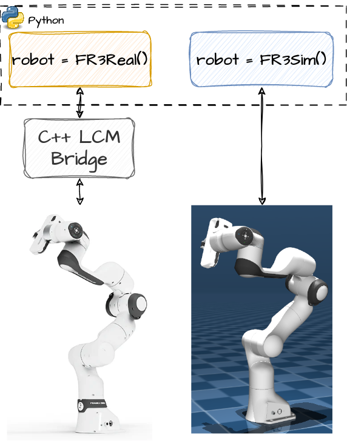

# FR3Py
FR3Py is unified Python simulation and hardware communication environment for Franka FR3 robots. The motivation of this project is to remove the burden of developing an easy interface for the robot, and minimize the effort required for going from simulation to real-world by provides an identical Python class to interface with simulation and the real robot. All you need to do, is changing one class!

<p align="center">
  
</p>


## Installation

The C++ bridge should be excuted on a computer with preempt-RT kernel patch applied and docker installed. This computer communicates with the robot on one end and interracts with the FR3Py python class running on the same computer or any other computer on the same network. 

### Linux Kernel with Preempt-RT Kernel Patch
Install the preempt-RT Linux kernel as instructed on the Franka official Linux installation procedure [here](https://frankaemika.github.io/docs/installation_linux.html#setting-up-the-real-time-kernel).
### Install Docker
Make sure docker is installed as instructed [here](https://docs.docker.com/engine/install/ubuntu/).
### Install Dev Containers Extension
FR3Py provides the `.devcontainer` configuration files required for easy and quick installation of the development environment. This requires the Dev Containers extension to be installed in your VSCode.


<!-- ### Prerequisite 
We assume libfranka has been installed systemwide. If not, follow through the **Building libfranka** steps [here](https://frankaemika.github.io/docs/installation_linux.html) and at the end, do `sudo make install to install the library system-wide. 

### FR3Py
Simply install with pip in the root directory of the repository:
```bash
python3 pip3 install .
```

### C++ Bridge
Compile and install the bridge as follows:

```bash
cd fr3_bridge
mkdir build && cd build
cmake ..
make -j $(( $(nproc) - 1 ))
make 
sudo make install
```

## Gripper Python Bindings
To control the gripper with python install the `fr3_gripper` as instructed [here](fr3_gripper/README.md). -->

## Usage
### Workflow for the Real Robot
#### Step0 
Enable the Multicast for the interface connected to the robot's network. To do so, first identify the name of that interface based on the IP address of the robot:
```bash
ifconfig
```
Then run the `unicast_config.py` file in the `tools` directory of this repository with the identified interface name as the argument:
```bash
sudo python3 tools/multicast_config.py <interface_name> # e.g. eth0
```
#### Step1
Open the repository folder inside your VSCode. Then press `SHIFT+CTRL+P` and choose `Rebuild and Reopen in Container`. After the completion of the build process open a terminal inside the container and run the FR3 C++ bridge:  

```bash
fr3_joint_interface <robot_ip> <unique_robot_ID> <interface_type>
```
The `unique_robot_ID` is a unique name used to determine the name of the LCM topics corresponding to the robot with IP `robot_ip`. Furtheremore, `interface_type` determines how we want to control the robot. Currently, joint torque (`torque`) and joint velocity (`velocity`) types are supported.

***Note:*** Step1 assumes that the `FCI` interface is enabled through the `Desk` and the robot's FCI ethernet port (the port on the main control box and not the robot base) is connected to the local network of the development PC.

#### Step2

The robot is now ready to take commands from your python script. It is as easy as:
```python
from FR3Py.robot.interface import FR3Real
from FR3Py.robot.model import PinocchioModel
robot = FR3Real(robot_id='fr3_robot1') # The same ID used when running the bridge
model = PinocchioModel()
while running:
    state = robot.getStates()
    info = model.getInfo(state['q'], state['dq'])
    
    #User control computations to compute the joint velocity or torque command u ...

    robot.sendCommands(u)
```
### Workflow for Simulation

The simulation API is exactly the same as that used for controlling a real robot. Simply enable xhost request access in a system terminal by running:
```bash
xhost + 
```
Then open the repository folder inside your VSCode and press `SHIFT+CTRL+P` and choose `Rebuild and Reopen in Container`. After the completion simulate the robot simply by changing the robot object in your python code with the simulation opject:

```python
from FR3Py.robot.interface import FR3Real
from FR3Py.robot.model import PinocchioModel
robot = FR3Sim(interface_type='velocity') # Simulation with joint velocity and joint torque interfaces are supported.
model = PinocchioModel()
while running:
    state = robot.getStates()
    info = model.getInfo(state['q'], state['dq'])
    
    #User control computations to compute the joint velocity or torque command u ...

    robot.sendCommands(u)
```

## Examples
A set of examples and tutorials are provided [here](examples/) to get you up and running quickly.

<!-- ## Detailed Implementation in CRRL L028
### Step1: preparation
1. Power on the Franka arm (power button on the black control box).
2. Turn on the middle computer: `Advanced Options for Ubuntu` -> `Ubuntu, with Linux 5.9.1-rt20`.

### Step2: setup the Franka arm
1. On the middle computer, open the Franka control panel: `https://192.168.123.250/desk/` In Firefox.
2. On the Franka control panel, click `Activate FCI` in the top-left menu.
3. On the Franka control panel, in the `Joints` panel, click the unlock button.

### Step3: setup the communication network betweem the middle computer and another computer
1. On the middle computer, open the terminal and run the following command `ifconfig` to get the IP address of the middle computer. This typically starts with `192.168.XXX.XXX`. 
2. Run the following command on the middle computer to enable multicast support for the particular interface used for connecting to the local network. 
```bash
sudo python3 ~/FR3Py/tools/multicast_config.py <interface_name> # e.g. enp3s0f0
```
3. On the another computer, run `ifconfig` agai. Open the terminal and run the following command to connect to the middle computer.
```bash
sudo python3 FR3Py/tools/multicast_config.py <interface_name> # e.g. enp0s31f6
``` -->

<!-- ### Step2: communicate with the robot -->
<!-- Run the C++ node to communicate with the robot: 

```bash
fr3_joint_interface <robot_ip> <robot_name> <interface_type>
```
where `robot_name` is a unique name used to determine the name of the LCM topics used for the robot with IP `robot_ip` and `interface_type` determines how we want to command the robot. Currently, `torque` and `velocity` are supported. For example, `fr3_joint_interface 192.168.123.250 fr3 torque`. -->


<!-- ## Simulation -->


<!-- ### Isaac Sim 
We provide a simple simulation environment based on the Isaac Sim. The Isaacsim simulation only implements the joint velocity interface. The API follows the exact interfacing API as the one used for communicating with the real robot, and is designed to simulate the experience of using the real-robot as closely as possible.

To use the simulator, create a link to the builtin Python interpreter provided by Isaac Sim:

```bash
cd FR3Py
ln -s ${ISAACSIM_PATH} _isaac_sim
```
where `ISAACSIM_PATH` points to the installation path of the simulator. Then install FR3Py for the Python interpreter provided by Isaac Sim:

```bash
./fr3py.sh -i
```

After installation, we can run the simulation node simply by running the `fr3py.sh` with the `--sim` option:

```bash
./fr3py.sh --sim
```
Then communicate with the robot through three simple API calls:

```python 
from FR3Py.sim.interface import FR3IsaacSim
robot = FR3IsaacSim(robot_id='fr3')

images = robot.readCameras()
state = robot.getStates()
robot.sendCommands(cmd)
```

**Note:** The simulation scene and configuration can be changed through the modification of the `FR3Py/sim/isaac/sim_config.yaml` file. Note that after modification, the package must be installed again through `./fr3py.sh -i`. 
 -->
