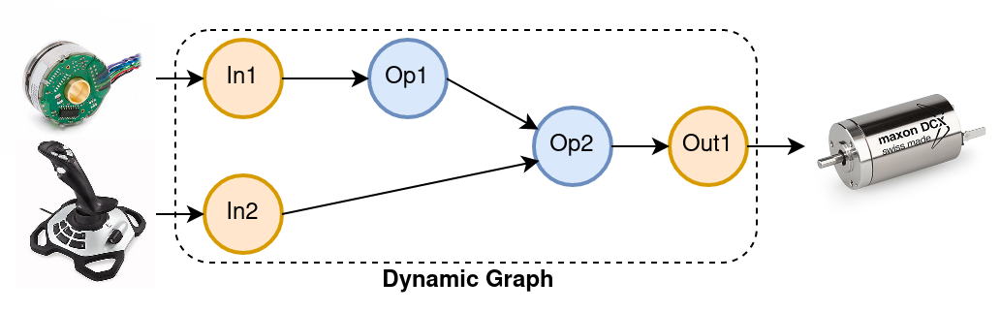

```{include} ../../README.md
:relative-images:
```

## Dynamic Graph Manager

Dynamic graph manager is a package that provides a simple interface between the drivers of a robot, and a computation graph that represents the controller algorithm. The implementation here is based on the LAAS-CNRS dynamic graph framework.


As shown below, the dynamic graph provides a powerful and conceptually easy-to-understand language to present the control framework. It has inputs that are generated by the sensors on the robot and the user commands, and the outputs that are sent to the actuators: 



The dynamic graph is built around a shared memory and several computation and data management threads that interchange information between each other in a harmony defined by a network of interprocess synchronization mechanisms. 

Depending on the application, dynamic graph manager may be used in two different ways:

- Defining computation nodes in C++ and hooking them up together (either through python or C++ API) to define a graph that represents the control system of the robot. 

- Directly reading the sensor values from and writing the control commands to the shared memory through a third-party process in python. 

This repository is meant to be used based on the second approach. Specifically, the real-time mechanisms built into DGM handle the timely transfer of data between the shared memory and the robot while the controller algorithm in python reads and writes to this memory (as an intermediate space) without worrying about meeting the tight hardware timing constraints imposed by the robot interface.

As opposed to the original [DGM project](https://github.com/machines-in-motion/dynamic_graph_manager), this repository uses a modified version that produces trigger signals for the Python node whenever a new sensor measurements is available. Furthermore, a trigger signal is also used to trigger the update of the shared memory for robots that use a callback to implement the controller.

## Installation

### Using Docker (Recommended)

The simplify the whole process, we have created a Dockerfile that can be used to create an isolated container with all the required tool sets for running the DGM. We have also included a code-server and jupyter notebook to simplify the development process. 

You can build your own image or you can pull our pregenerated image on Dockerhub:

```bash
# Build and run your own image:
docker build <name:tag> .

docker run -it --network host --privileged --volume "$(pwd)":/root/host_dgm_franka <name:tag>

# Or pull our own prebuilt image and use it:
docker run -it --network host --privileged --volume "$(pwd)":/root/host_dgm_franka robocaster/dgm-franka:amd64
```

Note that the container should run on a host computer with Preempt-RT kernel ([installation guid](https://frankaemika.github.io/docs/installation_linux.html)) and with `--previledged` execution mode and access tho host network through setting the `--network` to host.

Running the container starts a VSCode server that can be accessed through the `localhost` IP address and port 8080. Within the VSCode space, the user can launch the Jupter notebook server and access it through another tab. 

### Install From Source

First, install ROS foxy as explained [here](https://docs.ros.org/en/foxy/Installation/Ubuntu-Install-Debians.html) and source it in the working terminal. Then, install the following prerequisite packages:

```bash
sudo apt-get install ros-foxy-rosidl-generator-cpp libcereal-dev build-essential libboost-all-dev\
freeglut3 freeglut3-dev libedit-dev libtinyxml2-dev libyaml-cpp-dev ros-foxy-ament-cmake-nose python-all-dev
```

In order to prevent Python version problems, we assume that a virtual environment with Python 3.8.10 has been created and activated:

```bash
# Install the virtualenvwrapper
pip3 install virtualenvwrapper
export WORKON_HOME=~/Envs
mkdir -p $WORKON_HOME
source ~/.local/bin/virtualenvwrapper.sh

#Make the environment and activate it
mkvirtualenv -p python3 dgm_env
workon dgm_env 
```

Now, install the following dependencies:

```bash
pip install lark catkin_pkg nose==1.3.7 numpy
# A fix for ROS
pip uninstall em
pip install empy 
```

Finally, install the libfranka library and Preempt-RT kernel as instructed [here](https://frankaemika.github.io/docs/installation_linux.html). 


We use [treep](https://pypi.org/project/treep/) to manage the repositories used for our projects. First, clone our treep configurations:

```bash
mkdir ~/dgm-ws && cd ~/dgm-ws
git clone https://github.com/Rooholla-KhorramBakht/treep_projects.git
treep --clone DYNAMIC_GRAPH_MANAGER
```

The last command creates a `workspace/src` directory and clones the required repositories. Finally, run the compile command and source the installation script as follows:

```bash
source /opt/ros/foxy/setup.bash
colcon build
source install/setup.bash
```

<!-- ## How to Use It?

This section addresses the use case where a python node directly reads and writes the shared memory. This is done using classes defined in `notebooks/<dynamic/kinematic>_interface.ipynb` notebooks. 

The interface classes defined in these notebooks, take the DGM YAML configuration file and tap into the created shared memory. It then registers an LCM callback that gets called on the reception of the trigger signals from DGM. Each time a new measurement is available, DGM sends this signal and triggers the computation of one control iteration. 

In addition to running the control algorithm, this class can also record the input/output data into a CSV file. Furthermore, an online plot of the data has been made possible by sending ZMQ messages to [Plotjugger](https://www.plotjuggler.io/) which is an open-source data plotting and recording tool. 

Before running the notebooks, start the dynamic graph manager for the dynamic or kinematic interface as follows:

```bash
# To be added
```

Then, follow the instructions provided in the notebooks and try out the demo controllers. -->

```{toctree}
:caption: 'Tutorial:'
:hidden:
:maxdepth: 2

tutorial/index
```
