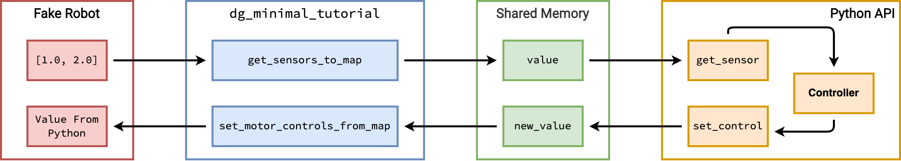

# Minimal Dynamic Graph Manager Tutorial

This section of the documentation provides a minimal example of the usage of Dynamic Graph Manager (DGM).

:::{figure-md} minimal_dgm



Sturcture of the Minimal DGM Tutorial 
:::

As we can see from the above figure, when using DGM you would have four components:
- the "fake robot" in this tutorial takes the place of the actual robot when using `dgm_franka`;
- the `dg_minimal_tutorial` communicates between the robot and DGM by reading sensor data from the robot and setting contol commands to the robot;
- the shared memory is a communication pipeline between the Python API and the C++ based `dg_minimal_tutorial`;
- the Python API is where the controller is implemented.

## Installation

The source code of `dg_minimal_tutorial` can be found at this [link](https://github.com/BolunDai0216/dg_minimal_tutorial). To install the package, first clone the package and build it

```console
git clone https://github.com/BolunDai0216/dg_minimal_tutorial.git
cd dg_minimal_tutorial
mkdir build && cd build
cmake ..
cmake --build .
cmake --install . --prefix "<dir-to-dg_minimal_tutorial>/dg_minimal_tutorial/install"
```

Fill `<dir-to-dg_minimal_tutorial>` with the absolute path of the directory `dg_minimal_tutorial` is in.

## Run Minimal Example

In the root directory of `dg_minimal_tutorial` run the generated executable

```console
./install/lib/dg_minimal_tutorial/dg_minimal_tutorial_main
```

Add the location of `dynamic_graph_manager_cpp_bindings` to `PYTHONPATH`, if following the installation instruction of `dgm_franka` you should be able to add it to `PYTHONPATH` using the command

```console
export PYTHONPATH=$PYTHONPATH:~/dgm-ws/install/dynamic_graph_manager/lib/python3.8/site-packages
```

Open another terminal, and run the Python test file

```console
python3 python/test.py
```

you should see an output similar to

```console
Loading parameters from /home/mocap/Documents/dg_minimal_tutorial/config/dg_minimal_tutorial.yaml
Seting up cond_var
Value in shared memory is: [1. 2.]
```

in the Python console. If this works, then it indicates everything is working properly.

## How this is created?

This is not magic, so let's see step by step how we can create the structure showed in the above figure. 

### Shared Memory

First, let's define what is in the shared memory. We do this by defining a [yaml file](https://github.com/BolunDai0216/dg_minimal_tutorial/blob/main/config/dg_minimal_tutorial.yaml). The content of this yaml file is

```yaml
is_real_robot: true

device:
  name: "dg_minimal_tutorial"
  sensors:
    value:
      size: 2
  controls:
    new_value:
      size: 2

hardware_communication:
  maximum_time_for_user_cmd: 100000
  max_missed_control: 10
  control_period: 1000000
  shared_memory_name: "DGM_ShM"
  timer_triggered: true
```

We can see that the name of the two parts within the shared memory `value` and `new value` is directly defined here. In addition to their names, we also define their size, here both have `size: 2` which indicates that they are both arrays with size 2. All the other terms are required, so do not miss any of them.

### `dg_minimal_tutorial`

The class that passes the sensor data and control command between the shared memory and the "Fake Robot" is defined [here](https://github.com/BolunDai0216/dg_minimal_tutorial/blob/main/src/dg_minimal_tutorial.cpp). From the header file, we can see that it is overwritting three functions of the parent class `dynamic_graph_manager::DynamicGraphManager()`:

```cpp
void DGMinimalTutorial::initialize_hardware_communication_process() {
    std::cout << "Initialized Hardware Communication Process" << std::endl;
}

void DGMinimalTutorial::get_sensors_to_map(dynamic_graph_manager::VectorDGMap& map) {
    map["value"](0) = 1;
    map["value"](1) = 2;
}

void DGMinimalTutorial::set_motor_controls_from_map(const dynamic_graph_manager::VectorDGMap& map) {
    dynamicgraph::Vector value = map.at("new_value");   
    std::cout << "New value is: (" << value[0] << ", " << value[1] << ")" << std::endl;
}
```

The `initialize_hardware_communication_process` function is only called once when we first run the executable. Then, as define in `control_period` (it is defined in nanoseconds, 1e6 ns = 1 ms), we the functions `get_sensors_to_map` and `set_motor_controls_from_map` are ran at 1000 Hz. At each iteration, `get_sensors_to_map` sets the value of `value` in the shared memory to `[1, 2]`, and `set_motor_controls_from_map` reads the value of `new_value` in the shared memory and prints it to the console.

### `dg_minimal_tutorial_main`

This [file](https://github.com/BolunDai0216/dg_minimal_tutorial/blob/main/src/dg_minimal_tutorial_main.cpp) creates a ROS node that: (1) reads from the yaml file; (2) creates the shared memory; (3) runs the loop between `dg_minimal_tutorial` and the shared `memory`; (4) reads sensor data and sets control commands. 

```cpp
int main(int /*argc*/, char* /*argv*/[]) {
  
  std::string yaml_params_file = std::string(CONFIG_PATH);

  std::cout << "Loading parameters from " << yaml_params_file << std::endl;
  YAML::Node param = YAML::LoadFile(yaml_params_file);

  dg_minimal_tutorial::DGMinimalTutorial dgm;

  dgm.initialize(param);
  dgm.run();

  // Wait until ROS is shutdown
  std::cout << "Wait for shutdown, press CTRL+C to close." << std::endl;
  dynamic_graph_manager::ros_spin();
  dynamic_graph_manager::ros_shutdown();
}
```

The path of the config file `CONFIG_PATH` is set within `CMakeLists.txt`. In `dg_minimal_tutorial`, the `CONFIG_PATH` variable is set by the following line:

```cmake
target_compile_definitions(dg_minimal_tutorial_main PUBLIC CONFIG_PATH="${PROJECT_SOURCE_DIR}/install/${CONFIG_DESTINATION}/dg_minimal_tutorial.yaml")
```

An executable of this file is generated when building `dg_minimal_tutorial`, which should be ran before running the Python API.

### Python API

In Python, we first need to 

```python
import dynamic_graph_manager_cpp_bindings
```

since it is likely not in a standard location, before importing it, we would first need to enable Python to find the shared library file (`.so` file) that contains `dynamic_graph_manager_cpp_bindings`. We do this by setting the environment variable `PYTHONPATH` to the directory that contains the `.so` file:

```console
export PYTHONPATH=$PYTHONPATH:~/dgm-ws/install/dynamic_graph_manager/lib/python3.8/site-packages
```

Then, we can read from and write to the shared memory

```python
config_file = ("<dir-to-dg_minimal_tutorial>/dg_minimal_tutorial/config/dg_minimal_tutorial.yaml")
head = dynamic_graph_manager_cpp_bindings.DGMHead(config_file)

head.read()
value = head.get_sensor("value")
print(f"Value in shared memory is: {value}")

head.set_control("new_value", np.array([1.0, 2.0]))
head.write()
```

The line 

```python
head = dynamic_graph_manager_cpp_bindings.DGMHead(config_file)
```

creates a dynamic graph head (dgh) that is used to communicate with the shared memory. The lines

```
head.read()
value = head.get_sensor("value")
print(f"Value in shared memory is: {value}")
```

reads from the shared memory using the dgh and prints the value of `value` in the shared memory. In this case, it should print `Value in shared memory is: [1. 2.]`. Then, we can write to the shared memory using the lines

```python
head.set_control("new_value", np.array([1.0, 2.0]))
head.write()
```

We are specifying the part of the shared memory we are writing to is `new_value` and the value of `new_value` we want to set is `[1.0, 2.0]`, we use a NumPy array to pass the value.

## Next Steps

Now that you have a basic understanding of DGM, you should move on and try it on FR3.
